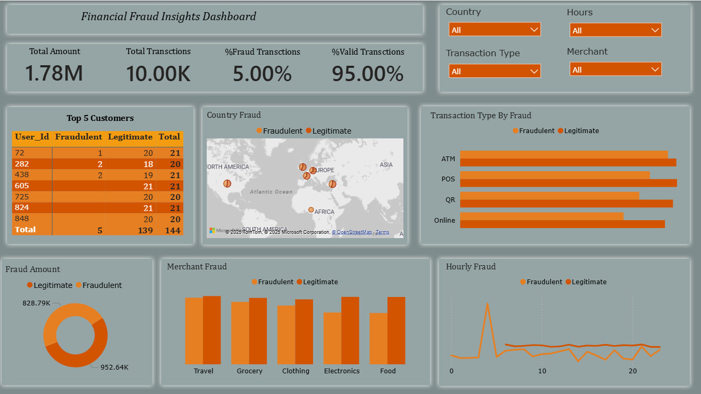

# 📊 Financial Fraud Analysis (MySQL + Power BI)

This project analyzes synthetic financial transaction data to identify fraud patterns and compare fraudulent vs legitimate behavior across multiple business dimensions.  
Using **MySQL** for data cleaning & analysis and **Power BI** for interactive visualization, the project highlights high-risk countries, fraud-prone transaction types, merchant categories, hourly fraud trends, and suspicious user patterns.

---
## 📁 Project Structure (Table Format)

| Folder / File                               | Description                                      |
|---------------------------------------------|--------------------------------------------------|
| **data/**                                    | Dataset used for analysis                        |
| └── synthetic_fraud_dataset.csv              | Raw synthetic fraud transaction dataset          |
| **sql/**                                     | SQL analysis scripts                             |
| └── fraud_analysis_.sql                      | All MySQL queries used in the project            |
| **dashboard/**                               | Power BI dashboard files & visuals               |
| └── Financial_Fraud_Dashboard.png            | Dashboard screenshot                             |
| └── Financial_Fraud_Analysis.pbix            | Power BI report file (interactive dashboard)      |
| **reports/**                                 | Project documentation and presentations          |
| └── Fraud_Analysis Report.docx               | Full project report                              |
| └── Business Problem for Fraud.docx          | Detailed business problem statement              |
| **README.md**                                | Project overview and documentation               |

---

## 🧩 Project Overview

This project explores fraudulent financial activity by analyzing 10,000 synthetic transactions.  
The dataset includes transaction amount, type, merchant category, country, hour, and fraud labels.  
The goal is to uncover insights such as:

- Which countries are most affected by fraud?
- Which transaction types or merchant categories have higher risk?
- What time of day fraud happens the most?
- Which users show unusual behavior?
- How much money is lost to fraud?

The final Power BI dashboard helps stakeholders identify patterns and make data-driven fraud prevention decisions.

---

## 📊 Data Summary

The dataset contains **10,000 transactions** with the following attributes:

- Transaction ID & User ID  
- Amount  
- Transaction Type (ATM, POS, QR, Online)  
- Merchant Category  
- Country  
- Hour (0–23)  
- Device Risk Score & IP Risk Score  
- Fraud Label (Legitimate / Fraudulent)

---

## 🧠 SQL Business Questions Solved

Structured analysis was performed in MySQL to answer key fraud-related questions:

1. **Fraud Amount by Hour** – Comparison of fraud vs legitimate amounts by hour of day.

2. **Fraud by Transaction Type** – Fraud trends across ATM, POS, QR, and Online modes.
   

3. **Merchant Category Analysis** – Which merchants face higher fraudulent activity?

  
4. **Country-wise Fraud Comparison** – Identify high-risk countries.
    

5. **User Activity Analysis** – Detect users with abnormal transaction counts.
   

6. **Overall Fraud vs Legitimate Amount** – Total monetary comparison.

    

---

## 📈 Power BI Dashboard

The interactive dashboard displays:

- Total Amount  
- Total Transactions  
- % Fraud & % Valid Transactions  
- Top Customers  
- Country Fraud Map  
- Fraud by Transaction Type  
- Merchant Fraud  
- Hourly Fraud Trends  

📌 **Dashboard Screenshot:**  

---

## 💡 Business Recommendations

- **Strengthen High-Risk Countries** – Add tighter fraud checks and verification.  
- **Secure Vulnerable Transaction Types** – Use extra authentication for risky modes.  
- **Monitor Fraud-Heavy Merchant Categories** – Track merchants with high fraud ratios.  
- **Increase Monitoring During Peak Fraud Hours** – Apply time-based fraud rules.  
- **Flag Suspicious Users** – Investigate users with abnormal transaction behavior.

---

## 🛠 Tools & Technologies

- **MySQL** – Data cleaning, transformation, and analysis  
- **Power BI** – Dashboard and visualization  
- **Excel** – Basic exploration  
- **SQL** – Querying and data preparation  

---

## 📌 Author

**Ravi Kumar Gupta**  
Data Analyst | Power BI | SQL | Python  

---

## ⭐ Summary

This project delivers an end-to-end fraud analysis workflow, from SQL data processing to a fully interactive Power BI dashboard.  
It provides valuable insights into fraud behavior and supports better decision-making for fraud prevention.

